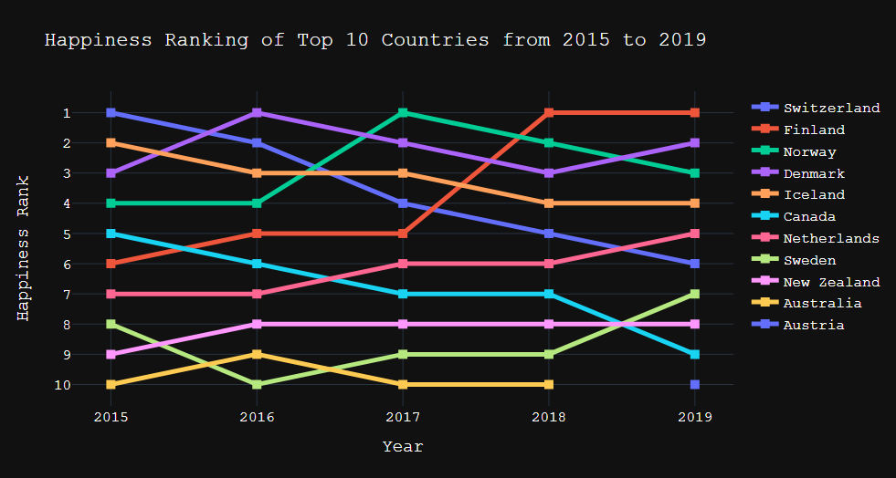
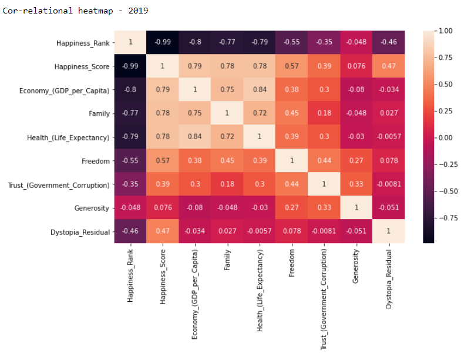
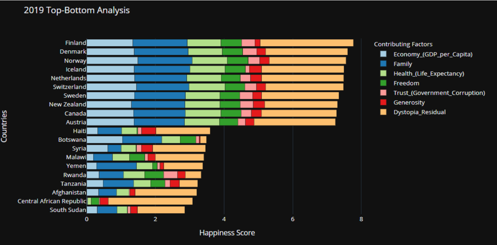
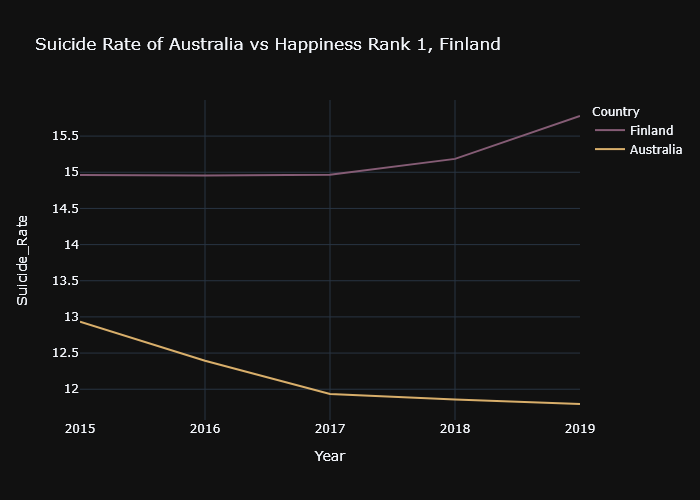

  

<h3 align="center">EDA: Analysis of Happiness Score of the Countries</h3>

---

  A report that breaks down the country's happiness score into meaningful insights.
      

## 📝 Table of Contents

- [Team](#Team)
- [About](#about)
- [Getting Started](#getting_started)
- [Observable Trends](#trends)
- [Acknowledgments](#acknowledgement)

## 🧐 Team 
•	Rye Capati
•	Sandra Teh
•	Cicily George
•	Bimal Prabha

## 🧐 About 
**Description:**
Analysing the happiness index of the world from the period 2015-2019.
Data clean-up:
1.	Merging data from 2015 to 2019
2.	Check for duplication
3.	Check for invalid value
4.	Make sure the data frame is consistent for all the data set.
5.	Make sure no rows accidentally deleted

**Summary**
1.	The top 10 and bottom 10  
2.	Factors contributing to Happiness Score:  
    •	Freedom to make life choices  
    •	GDP per capita  
    •	Generosity  
    •	Health Life expectancy  
    •	Perceptions of corruption  
    •	Family/social support  
    •	Dystopia Residual  

## 🏁 Getting Started 

**Questions to Answer:**  
1.	What is the correlation of country happiness and 7 factors?
2.	What is determining factor look like comparing to bottom 10?
3.	Do the countries in top 10 and bottom 10 stay consistent over the year?
4.	What are the countries that making greatest changes?
5.	What are the counties did not make any changes?
6.	Can we do a prediction in year 2020?
7.	Which region has the happiest countries?

## ✍️ Observable Trends 

* The world’s happiest countries are primarily in North Western Europe, North America, and Australia & New Zealand. 

* Economy (GDP per capita) is the most important factor in evaluating a country’s happiness.

* Economy is also strongly positively correlated with other factors like Family and Health. 

* Another interesting observable trend, GDP and generosity has negative correlation factor. Reinforcing that,income does not relate to how generous you are.

*	Heatmap strongly suggest GDP and family with the score above 75%, has the highest cor-relationship with happiness score.

* In much lower ranked countries even though their score was low, their family score was almost on par with the top 10 countries. Yes, there is a noticeable dip in 2016 but it came back stronger than ever in the last 3 years.

* In 2015  australia,north America  , some of European  and Asian countries were dominated by GDP. And again in 2016 majority of world happiness was influenced by GDP.

* From 2017 to 2019 we have another interesting observation – it was not the income, but in fact it was family score which dominated the world happiness score.

### Future Prediction of Australia - Linear Regression
Based on our rankings from the 2015 to 2019, we’ve made some predictions on the happiness score of Australia along with the predicted happiness score of the top 10th country (meaning the minimum score to get into the top 10) to see if we will make it to the top 10. 

### Bonus Part - Happiness Comparison with suicide Rate in the World
We have already established that European countries are  happiest countries in the world. Simultaneously they have highest suicide rates among other countries.
But, there is no evidence which shows that the countries with higher happiness score will have high suicide rate. And Australia is not there, which is good.

Finland is an example of a country with a high happiness score and high suicide rate. Australia's suicide rate is lesser than, most of the European nations.  Though Australia's suicide rate is lesser than, most of the European nations, our genrosity is higher than the top country and family values are on par with rank no. 1 So give a pat on your back for being kind and give a hug to your family

### Conclusion 
This analysis illustrated that the world’s happiest countries are primarily in North Western Europe, North America, and Australia & New Zealand. It also revealed that Economy (GDP per capita) is the most important factor in evaluating a country’s happiness. Unsurprisingly, the happiest countries and world regions generally tended to be ones with strong and stable economies. 

The importance of Economy is also strongly positively correlated with those of Family and Health. This is expected, since more economic stability and higher GDP per capita generally encourages stable and comfortable family life as well as increases the availability of proper medical resources and healthcare. These factors then weigh more when determining overall happiness. 

## 🎉 Acknowledgements 
- UWA Data Science
- Data source: https://www.kaggle.com/mathurinache/world-happiness-report?select=2020.csv
- Data source: Gmap – geography of the region and country
- Institute of Health Metrics and Evaluation (IHME), Global Burden of Disease (GBD): http://ghdx.healthdata.org/gbd-results-tool
- Rest Countries API: https://restcountries.eu/rest/v2/

